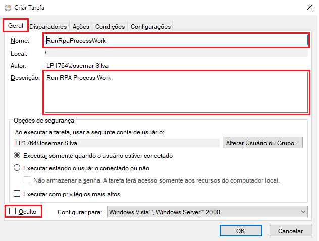
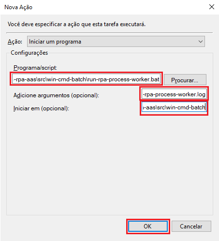

### README-Config-Agendador-Tarefas-Windows.md
Guia de Configuração do Agendador de Tarefas do Windows para o projeto [Jira RPA aaS](../README.md)

---

# 1. Passo a Passo

## 1.1. Iniciar o Agendador de Tarefas do Windows e criar uma tarefa

1. No menu do Windows, em configurações, no campo de texto para localizar informar `Agendar Tarefas`
2. Com o Agendador de Tarefas iniciado, clique na ação `Criar Tarefa ...` na barra de ações lateral direita

## 1.2. Configurar informações Gerais

1. No Agendador de Tarefas do Windows, *clique na aba* `Geral` e preencher as informações da seguinte forma:
  * Nome: `RunRpaProcessWork`
  * Descrição: `Run RPA Process Work`
  * `[x]` Oculto

## 1.3. Configurar Disparadores

1. No Agendador de Tarefas do Windows, *clique na aba* `Disparadores`
2. Se ainda não existir disparadores configurados Então clique no botão `Novo` Senão selecione o disparador e clique no botão `Editar`

4. Na caixa de diálogo `Novo Dispardor` preencher as informações da seguinte forma:
  * Configuração: `Uma vez`
  * Iniciar em: _a data e hora de hoje_
  * `[x]` Repetir a tarefa a cada: `1 minutos` por um período de tempo de `12 horas`
  * `[x]` Habilitado
5. Em seguida, ainda na caixa de diálogo `Novo Dispardor` clique no botão `OK` e observe a configuração de disparador criada

## 1.4. Configurar Ações da Tarefa

1. No Agendador de Tarefas do Windows, *clique na aba* `Ações`
2. Se ainda não existir ações configurados Então clique no botão `Novo` Senão selecione a ação e clique no botão `Editar`

4. Na caixa de diálogo `Nova Ação` preencher as informações da seguinte forma:
  * Programa/Script: `C:\GitHome\ws-github-01\jira-rpa-aas\src\win-cmd-batch\run-rpa-process-worker.bat`
  * Adicione argumentos: `> C:\GitHome\ws-github-01\jira-rpa-aas\src\win-cmd-batch\run-rpa-process-worker.log`
  * Iniciar em: `C:\GitHome\ws-github-01\jira-rpa-aas\src\win-cmd-batch`
5. Em seguida, ainda na caixa de diálogo `Nova Ação` clique no botão `OK` e observe a ação  criada

## 1.4. Configurar Condições

1. No Agendador de Tarefas do Windows, *clique na aba* `Condições`
2. Observe as configurações padrões

## 1.5. Configurar Configurações da Tarefa

1. No Agendador de Tarefas do Windows, *clique na aba* `Configurações`
2. Observe as configurações padrões

---

# 2. Referências

* n/a

---

[README Home page](../README.md)

