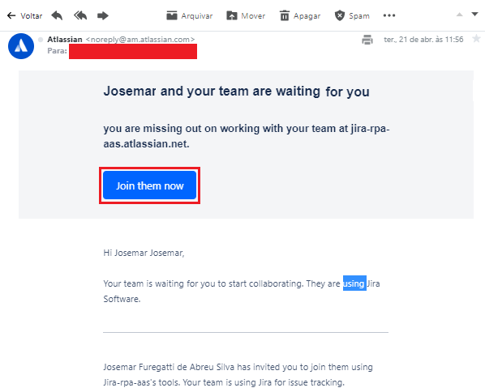

### README-Config-Jira-on-Cloud.md
Guia de Configuração da ferramenta Jira on Cloud *na nuvem* para o projeto [Jira RPA aaS](../README.md)

---

# 1. Passo a Passo

## 1.1. Criar o ambiente do Jira on Cloud na atlassian.net

1. No seu navegador, entrar no site `https://www.atlassian.com/try`
2. Na página de produtos da Atlassian, clique no botão `Try` abaixo do ícone *Jira Software*

3. Na página de produtos gratuitos da Atlassian, clique no botão `Choose one` da opção *Jira Software*

---

## 1.2. Preencha as inforamções básicas do serviço Jira Cloud

1. Sua escolha foi `Jira Software :: Cloud Free` que te garente
  * acesso a funcionalidades gratuitas
  * 2 GB de armazenamento
  * até 10 usuários
  * suporte da comunidade
2. Preencha seu nome
  * Name: `seu nome`
  * Last Name: `seu sobrenome`
  * Site name: `nome do seu site`
3. Clique no botão `Agree and Sign In`

4. Clique em `Skip question` para pular a classificação de seu site que não é obrigatória

---

## 1.3. Convide os membros do seu time

1. Preencha os campos do formulário com os endereços de e-mail de cada um dos membros do seu time:
  * e-mail: `e-mail do membro de seu time`

2. Clique no botão avançar

3. Cada um dos membros do time que você informou o e-mail irá receber um e-mail conforme este abaixo, convidando-o para entrar no projeto

4. Preencha as perguntas da pesquisa sobre o conhecimento dos usuários e em seguida clique no botão `Próximo` na próxima pergunta

---

## 1.4. Defina o template de seu projeto

1. Selecione o template de `Negócio`

2. Selecione a opção `Controle de Processo`

---

## 1.5. Crie o seu projeto

1. Preencha as informações do nome do projeto
  * Nome: `RPA`
  * Chave: `RPA`

2. Em seguida clique no botão `Criar`

3. Pronto! Seu ambient no *Jira Cloud* foi criado para seu projeto
  * Link de acesso [https://jira-rpa-aas.atlassian.net/](https://jira-rpa-aas.atlassian.net/)

4. Você pode alterar a visão que tem dos itens:
  * clique no botão `Resumo` para acessar a resumo
  * clique no botão `Painel` para acessar o painel

---

# 2. Referências

* [Try Jira](https://www.atlassian.com/try)

---

[README Home page](../README.md)

