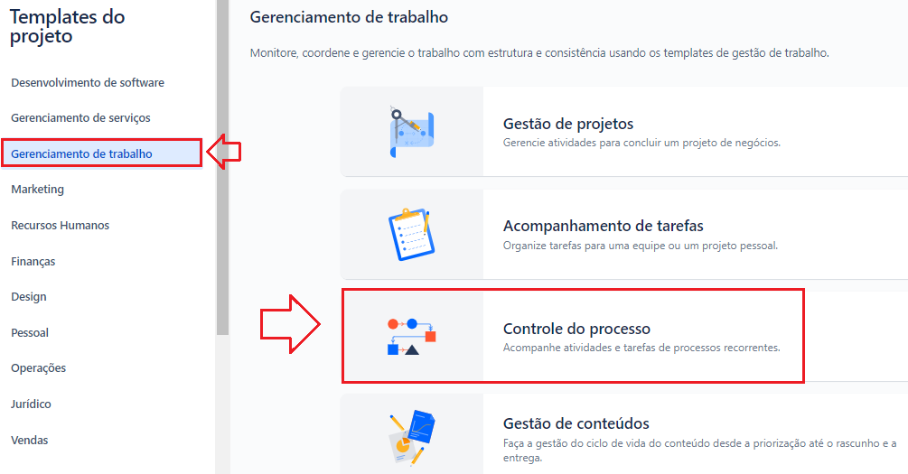
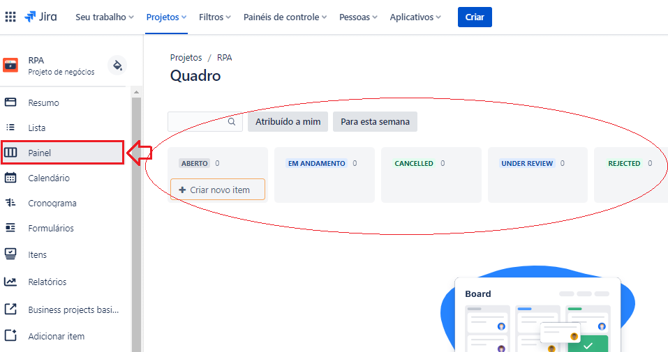
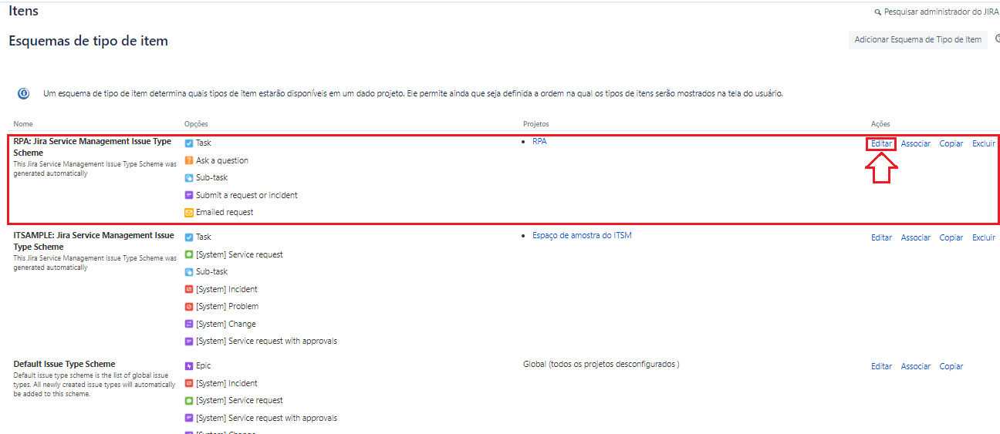
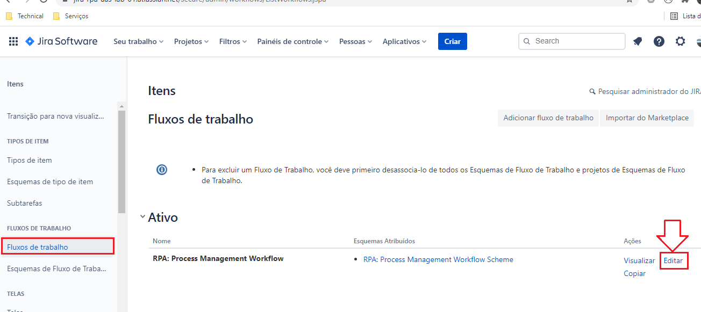
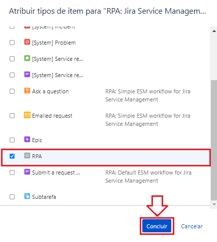
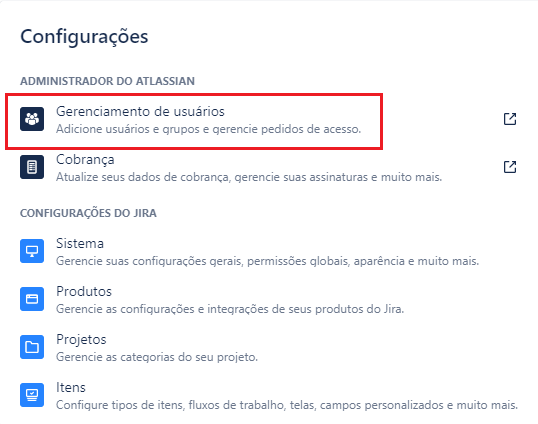
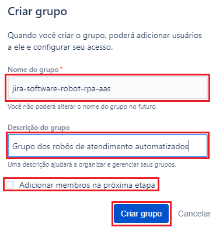
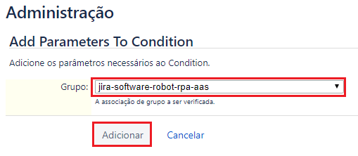

### README-Config-Jira-on-Cloud.md
Guia de Configuração da ferramenta Jira on Cloud *na nuvem* para o projeto [Jira RPA aaS](../README.md)

---

*Índice*

---

# 1. Passo a Passo

## 1.1. Criar o ambiente do Jira on Cloud na atlassian.net

#### 1.1.1. No seu navegador, entrar no site `https://www.atlassian.com/try`
#### 1.1.2. Na página de produtos da Atlassian, clique no botão `Try` abaixo do ícone *Jira Software*

#### 1.1.3. Na página de produtos gratuitos da Atlassian, clique no botão `Choose one` da opção *Jira Software*

---

## 1.2. Preencha as inforamções básicas do serviço Jira Cloud

#### 1.2.1. Sua escolha foi `Jira Software :: Cloud Free` que te garente
  * acesso a funcionalidades gratuitas
  * 2 GB de armazenamento
  * até 10 usuários
  * suporte da comunidade
#### 1.2.2. Preencha seu nome
  * Name: `seu nome`
  * Last Name: `seu sobrenome`
  * Site name: `nome do seu site`
#### 1.2.3. Clique no botão `Agree and Sign In`

#### 1.2.4. Clique em `Skip question` para pular a classificação de seu site que não é obrigatória

---

## 1.3. Convide os membros do seu time

Atenção: No tópico [1.8](#18-configurar-grupo-de-usuários-rpa) você poderá convidar mais pessoas

#### 1.3.1. Preencha os campos do formulário com os endereços de e-mail de cada um dos membros do seu time:
  * e-mail: `e-mail do membro de seu time`

#### 1.3.2. Clique no botão avançar

#### 1.3.3. Cada um dos membros do time que você informou o e-mail irá receber um e-mail conforme este abaixo, convidando-o para entrar no projeto

#### 1.3.4. Preencha as perguntas da pesquisa sobre o conhecimento dos usuários e em seguida clique no botão `Próximo` na próxima pergunta

---

## 1.4. Defina o template de seu projeto

Atenção: Conforme a versão da ferramenta Jira, o projeto template pode ser definido no momento da criação do projeto e não neste momento.

#### 1.4.1. Selecione o template de `Negócio`

#### 1.4.2. Selecione a opção `Controle de Processo`

---

## 1.5. Crie o seu projeto de RPA

#### 1.5.1. Preencha as informações do nome do projeto
  * Nome: `RPA`
  * Chave: `RPA`

#### 1.5.2. Em seguida clique no botão `Criar`

#### 1.5.3. Pronto! Seu projeto foi criado em seu ambiente do *Jira Cloud* 
  * Link de acesso [https://jira-rpa-aas.atlassian.net/](https://jira-rpa-aas.atlassian.net/)

#### 1.5.4. Você pode alterar a visão que tem dos itens:
  * clique no botão de menu lateral esquerdo `Filas` para acessar a fila de chamados
  * clique no botão de menu superior `Painéis de controle` para acessar o painel de controle. Mais para frente vamos configurar uma a visão deste painel para ficar parecida com um Dashboard de Kanban.

---

## 1.6. Crie o Tipo de Item e Esquema de Tipo de Item de RPA

#### 1.6.1. No menu superior principal clique no ícone de engrenagem e em seguida no item de menu `Itens`

#### 1.6.2. Na página `Itens` :: `Tipos de Itens`

* observe as configurações existentes: `Epic`, `Task` e `Sub-Task`

#### 1.6.3. Na página `Itens` :: `Tipos de Itens`

* clique no botão `Adicionar Tipo de Item`

#### 1.6.4. Na caixa de diálogo `Adicionar Tipo de Item`, preencha os campos da seguinte forma:

  * Nome: `RPA`
  * Descrição: `RPA`
  * Tipo: `Tipo de item padrão`
  * Clique no botão `Adicionar`

#### 1.6.5. Na página `Itens` :: `Tipos de Itens`, observe as configurações existentes: `Epic`, *`RPA`*, `Task` e `Sub-Task`

  * Observe a nova configuração de tipo de item criada: `RPA`
  * Observe que na coluna `Respectivo Esquema` há 2 Esquemas de tipos de itens: `Default Issue Type Scheme` e `RPA: Process Management Issue Type Scheme` associados aos itens

#### 1.6.6. Na página `Itens` :: `Tipos de Itens`, no sub-menu lateral esquerdo, clique na item de sub-menu `Esquema de tipos de itens`

  * Observe as configurações existentes

#### 1.6.7. Na página `Itens` :: `Esquema de Tipos de Itens`, no link `Editar` do _Esquema de Tipo de Item_ `RPA: Process Management Issue Type Scheme`

  * Seu objetivo será deixar apenas o _Tipo de Item_ `RPA` associado ao _Esquema de Tipo de Item_ `RPA: Process Management Issue Type Scheme` e ao _Projeto_ `RPA`
  * No passo (1), arraste e solte o item `RPA` da lista `Disponível Tipos de item` para a lista `Tipos de item para o esquema atual`
  * No passo (2), arraste e solte os itens que existem na lista `Tipos de item para o esquema atual` para a lista `Disponível Tipos de item`
  * No passo (3), defina o tipo de item padrão como sendo `RPA`
  * No passo (4), finalmente clique no botão `Salvar`

---

## 1.7. Configurar Fluxo de Trabalho do RPA

#### 1.7.1. No menu superior principal clique no ícone de engrenagem e em seguida no item de menu `Itens`

#### 1.7.2. Na página `Itens` :: `Tipos de Itens`, no sub-menu lateral esquerdo, clique na item de sub-menu `Fluxo de Trabalho`

#### 1.7.3. Na página `Itens` :: `Fluxo de Trabalho`, observe as configurações existentes: `RPA: Process Management Workflow`

  * Clique no link da ação `Editar` na linha correspondente a configuração `RPA: Process Management Workflow`

  * Seu objetivo será editar o Fluxo de Trabalho `RPA: Process Management Workflow` e deixá-lo conforme as configurações abaixo

#### 1.7.4. Na página `Itens` :: `Fluxo de Trabalho`, clique no link `Editar` correspondente a configuração `RPA: Process Management Workflow` e crie os seguintes _Status_:

| Status      | Categoria          |
| ----------- | ------------------ |
| `EM EDIÇÃO` | `Itens Pendentes`  |
| `SUBMETIDO` | `Em andamento`     |
| `CONCLUÍDO` | `Itens Concluídos` |
| `CANCELADO` | `Itens Concluídos` |
| `FALHA`     | `Itens Pendentes`  |

#### 1.7.5. Na página `Itens` :: `Fluxo de Trabalho`, clique no link `Editar` correspondente a configuração `RPA: Process Management Workflow` e crie as seguintes _Transitions_:

| Transição   | Status DE   |Status PARA   | Descrição            | Obs                  |
| ----------- | ----------- | ------------ | -------------------- | -------------------- |
|             | _início_    | `Open`       | Criar                |                      |
| `Submeter`  | `Open`      | `SUBMETIDO`  | Submeter             |                      |
| `Submeter`  | `EM EDIÇÃO` | `SUBMETIDO`  | Submeter             |                      |
| `Concluir`  | `SUBMETIDO` | `CONCLUÍDO`  | Concluir             |                      |
| `Cancelar`  | _qualquer_  | `CANCELADO`  | Cancelar             |                      |
| `Falhar`    | `SUBMETIDO` | `FALHA`      | Falhar               |                      |
| `Editar`    | `FALHA`     | `EM EDIÇÃO`  | RE-Editar            |                      |

#### 1.7.6. Na página `Itens` :: `Fluxo de Trabalho`, ao final da edição clicar no link `Publicar Rascunho`:

#### 1.7.7. Na página `Itens` :: `Tipos de Itens`, no sub-menu lateral esquerdo, clique na item de sub-menu `Equemas de Fluxo de Trabalho`

* Clique no sub-menu lateral esquerdo  `Esquemas de Fluxo de Trabalho`

* Localize o Esquemas de Fluxo de Trabalho associado ao projeto `RPA` (na coluna projeto) e clique no botão `Editar` correspondente

* Seu objetivo será *atribuir* o `Tipo de item` = `RPA` ao `Projeto` = `RPA` e workflow `RPA` configurado neste item
  * Provavelmente o cenário que você deverá encontrar é um esquema previamente configurado com todos os Tipos de Itens exceto o `RPA` que você deverá completar a configuração associando-o

---

## 1.8. Configurar Grupo de Usuários RPA

#### 1.8.1. No menu superior principal clique no ícone de engrenagem e em seguida no item de menu `Gerenciamento de usuários`

#### 1.8.2. Na página `Administrador` :: `Usuários`, no sub-menu lateral esquerdo, clique na item de sub-menu `Grupos`
  * Observe os seguintes grupos configurados: `administrators`, `jira-administrators`, *`jira-software-users`* ( ou *`jira-servicemanagement-users`* ) e `site-admins`
  * Todo novo usuário acrescentado ao site deve participar do grupo *`jira-software-users`* ( ou *`jira-servicemanagement-users`* ) para conseguir ter acesso ao site, criar issues, etc

#### 1.8.4. Na caixa de diálogo `Criar Grupo` informe os campos:
  * Clique no botão `Criar Grupo`
  * Nome do Grupo: `jira-software-robot-rpa-aas`
  * Descrição do Grupo: `Grupo dos robôs de atendimento automatizados`
  * `[x]` adicionar membros na próxima etapa
  * Clique no botão `Criar Grupo`

#### 1.8.5. Na caixa de diálogo `Adicionar Membros ao Grupo` informe os campos:
  * Informe os usuários que serão *robôs de atendimento* do serviço
  * Clique no botão `Adicionar`

---

## 1.9. Configurar Condições das Transições do Fluxo de Trabalho vs Grupo de Usuários

#### 1.9.1. No menu superior principal clique no ícone de engrenagem e em seguida no item de menu `Itens`

#### 1.9.2. Na página `Itens` :: `Tipos de Itens`, no sub-menu lateral esquerdo, clique na item de sub-menu `Fluxo de Trabalho`

#### 1.9.3. Na página `Itens` :: `Fluxo de Trabalho`, clique no botão `Editar` na linha correspondente a configuração `RPA: Process Management Workflow`

  * Seu objetivo será editar as transições em ( `Concluir` e `Falhar` ) e deixá-las restrita ao grupo de usuários `jira-software-robot-rpa-aas`
  * e editar todas as demais transições e deixá-las restrita ao grupo de usuários `jira-servicemanagement-users`
  * Clique na opção `Mostrar rótulos de transição` para facilitar a visualização

  * Para cada uma das transições em ( `Concluir` e `Falhar` )
    * Clique na transição, isto faz abrir uma caixa de diálogo na lateral direita
	* Clique no link `Condições` e em seguida no botão `Adicionar Condição`

	* Selecione a opção `O usuário está no grupo` e em seguida no botão `Adicionar Condição`

	* Na caixa de diálogo `Administração` :: `Add Parameters To Condition` selecione a opção `jira-software-robot-rpa-aas` e clique no botão `Adicionar`

	* Em seguida clique no link `Publicar Rascunho`
	* Não é preciso salvar uma cópia backup

---

## 1.10. Convidar e configurar as novas pessoas que serão usuarios do serviço

#### 1.10.1. Entrar no menu de configuração de pessoas do projeto

  * No menu superior principal clique no ícone de engrenagem e em seguida no item de menu `Projeto`

  * No formulário Gerenciar projetos, localizar a linha correspondente ao projeto `RPA` e clicar no botão de configuração do projeto (ícone de ...) 

  * No formulário `Projeto / RPA / Configurações de projeto - Detalhes`, no menu lateral esquerdo `Configuração do Projeto` clicar na opção de sub-menu `Configurações de projeto >> Pessoas`

  * No formulário `Projeto / RPA / Configurações de projeto - Pessoas` clicar no botão `Adicionar pessoas`
  * Na caixa de diálogo `Adicionar Pessoas` preencher o endereço de e-mail da pessoa convidada com a função `Service Desk Team` que já está previamente configurada

---

## 1.11. Configurar o acesso seguro do Robô de RPA através de TOKEN

#### 1.11.1. Entrar na administração do Jira para configurar acesso através de Token

  * No menu superior principal clique no ícone de 9 pontos para acessar a lista de opções de menu do produto
  * Na lista de opções de menu do produto clique no item de sub-menu `Administration`

  * No menu superior principal do produto `Atlassian Administrator` clique a opção de menu `Configurações`
  * Na lista de opções de menu da Administração clique no item de sub-menu `Atlassian Administrator >> chaves de API`

#### 1.11.2. Criar o Token de Acesso

  * No formulário `Atlassian Administrator :: Chaves de API` clique no botão `Criar chave API`
  * Na caixa de diálogo `Criar uma chave de API` informar:
    * Nome: `jira-rpa-aas`
	* clique no botão 

  * Guarde as informações da chave API de Token gerada porque você vai precisar desta inforamção:
    * Nome: `jira-rpa-aas`
	* ID da Organização: `************************************`
	* Chave de API: `********************`

---

# 2. Referências

* [Try Jira](https://www.atlassian.com/try)
* [Jira Cloud API Tokens (password generation)](https://confluence.atlassian.com/cloud/api-tokens-938839638.html)

---

[README Home page](../README.md)

