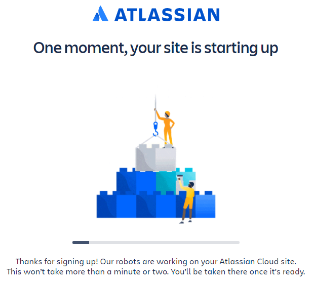
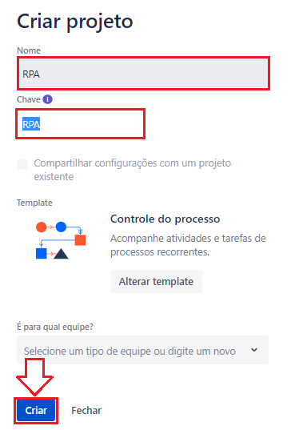
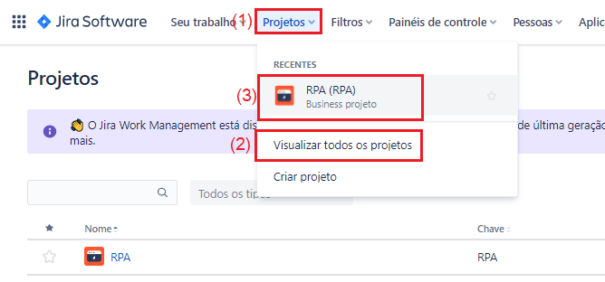
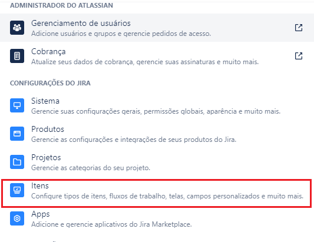
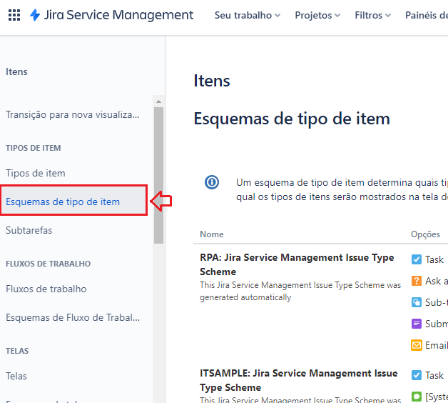
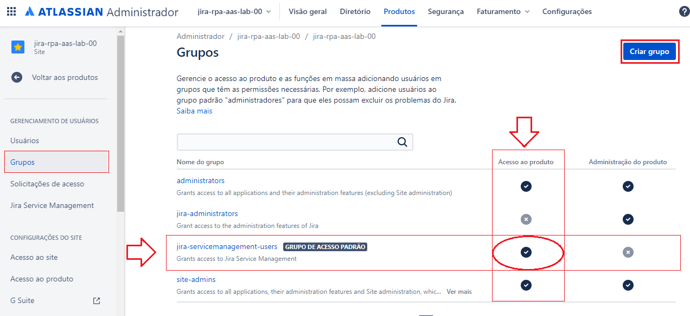

### README-Config-Jira-on-Cloud.md
Guia de Configuração da ferramenta Jira on Cloud *na nuvem* para o projeto [Jira RPA aaS](../README.md)

---

*Índice*

---

# 1. Passo a Passo

## 1.1. Criar o ambiente do Jira on Cloud na atlassian.net

1. No seu navegador, entrar no site `https://www.atlassian.com/try`
2. Na página de produtos da Atlassian, clique no botão `Try` abaixo do ícone *Jira Software*

3. Na página de produtos gratuitos da Atlassian, clique no botão `Choose one` da opção *Jira Software*

---

## 1.2. Preencha as inforamções básicas do serviço Jira Cloud

1. Sua escolha foi `Jira Software :: Cloud Free` que te garente
  * acesso a funcionalidades gratuitas
  * 2 GB de armazenamento
  * até 10 usuários
  * suporte da comunidade
2. Preencha seu nome
  * Name: `seu nome`
  * Last Name: `seu sobrenome`
  * Site name: `nome do seu site`
3. Clique no botão `Agree and Sign In`

4. Clique em `Skip question` para pular a classificação de seu site que não é obrigatória

---

## 1.3. Convide os membros do seu time

1. Preencha os campos do formulário com os endereços de e-mail de cada um dos membros do seu time:
  * e-mail: `e-mail do membro de seu time`

2. Clique no botão avançar

3. Cada um dos membros do time que você informou o e-mail irá receber um e-mail conforme este abaixo, convidando-o para entrar no projeto

4. Preencha as perguntas da pesquisa sobre o conhecimento dos usuários e em seguida clique no botão `Próximo` na próxima pergunta

---

## 1.4. Defina o template de seu projeto

1. Selecione o template de `Negócio`

2. Selecione a opção `Controle de Processo`

---

## 1.5. Crie o seu projeto de RPA

1. Preencha as informações do nome do projeto
  * Nome: `RPA`
  * Chave: `RPA`

2. Em seguida clique no botão `Criar`

3. Pronto! Seu ambient no *Jira Cloud* foi criado para seu projeto
  * Link de acesso [https://jira-rpa-aas.atlassian.net/](https://jira-rpa-aas.atlassian.net/)

4. Você pode alterar a visão que tem dos itens:
  * clique no botão `Resumo` para acessar a resumo
  * clique no botão `Painel` para acessar o painel

---

## 1.6. Crie o Tipo de Item e Esquema de Tipo de Item de RPA

1. No menu superior principal clique no ícone de engrenagem e em seguida no item de menu `Itens`

2. Na página `Itens` :: `Tipos de Itens`, observe as configurações existentes: `Epic`, `Task` e `Sub-Task`
3. Na página `Itens` :: `Tipos de Itens`, clique no botão `Adicionar Tipo de Item`

3. Na caixa de diálogo `Adicionar Tipo de Item`, preencha os campos da seguinte forma:
  * Nome: `RPA`
  * Descrição: `RPA`
  * Tipo: `Tipo de item padrão`
  * Clique no botão `Adicionar`

4. Na página `Itens` :: `Tipos de Itens`, observe as configurações existentes: `Epic`, *`RPA`*, `Task` e `Sub-Task`
  * Observe a nova configuração de tipo de item criada: `RPA`
  * Observe que na coluna `Respectivo Esquema` há 2 Esquemas de tipos de itens: `Default Issue Type Scheme` e `RPA: Process Management Issue Type Scheme` associados aos itens

5. Na página `Itens` :: `Tipos de Itens`, no sub-menu lateral esquerdo, clique na item de sub-menu `Esquema de tipos de itens`
  * Observe as configurações existentes

6. Na página `Itens` :: `Esquema de Tipos de Itens`, no link `Editar` do _Esquema de Tipo de Item_ `RPA: Process Management Issue Type Scheme`
  * Seu objetivo será deixar apenas o _Tipo de Item_ `RPA` associado ao _Esquema de Tipo de Item_ `RPA: Process Management Issue Type Scheme` e ao _Projeto_ `RPA`
  * Arraste e solte os itens entre as listas `Tipos de item para o esquema atual` e `Disponível Tipos de item`
  * Ao final clique no botão `Salvar`

---

## 1.7. Configurar Fluxo de Trabalho do RPA

1. No menu superior principal clique no ícone de engrenagem e em seguida no item de menu `Itens`

2. Na página `Itens` :: `Tipos de Itens`, no sub-menu lateral esquerdo, clique na item de sub-menu `Fluxo de Trabalho`

3. Na página `Itens` :: `Fluxo de Trabalho`, observe as configurações existentes: `RPA: Process Management Workflow`
  * Clique no link da ação `Editar` na linha correspondente a configuração `RPA: Process Management Workflow`
  * Seu objetivo será editar o Fluxo de Trabalho `RPA: Process Management Workflow` e deixá-lo conforme as configurações abaixo

4. Na página `Itens` :: `Fluxo de Trabalho`, clique no link `Editar` correspondente a configuração `RPA: Process Management Workflow` e crie os seguintes _Status_:

| Status      | Categoria          |
| ----------- | ------------------ |
| `EM EDIÇÃO` | `Itens Pendentes`  |
| `SUBMETIDO` | `Em andamento`     |
| `CONCLUÍDO` | `Itens Concluídos` |
| `CANCELADO` | `Itens Concluídos` |
| `FALHA`     | `Itens Pendentes`  |

5. Na página `Itens` :: `Fluxo de Trabalho`, clique no link `Editar` correspondente a configuração `RPA: Process Management Workflow` e crie as seguintes _Transitions_:

| Transição   | Status DE   |Status PARA   | Obs                  |
| ----------- | ----------- | ------------ | -------------------- |
|             | _início_    | `Open`       |                      |
| `Submeter`  | `Open`      | `SUBMETIDO`  |                      |
| `Submeter`  | `EM EDIÇÃO` | `SUBMETIDO`  |                      |
| `Concluir`  | `SUBMETIDO` | `CONCLUÍDO`  |                      |
| `Cancelar`  | _qualquer_  | `CANCELADO`  |                      |
| `Falhar`    | `SUBMETIDO` | `FALHA`      |                      |
| `Editar`    | `FALHA`     | `EM EDIÇÃO`  |                      |

6. Na página `Itens` :: `Fluxo de Trabalho`, ao final da edição clicar no link `Publicar Rascunho`:

---

## 1.8. Configurar Grupo de Usuários RPA

1. No menu superior principal clique no ícone de engrenagem e em seguida no item de menu `Gerenciamento de usuários`

2. Na página `Administrador` :: `Usuários`, no sub-menu lateral esquerdo, clique na item de sub-menu `Grupos`
  * Observe os seguintes grupos configurados: `administrators`, `jira-administrators`, *`jira-software-users`*  e `site-admins`
  * Todo novo usuário acrescentado ao site deve participar do grupo *`jira-software-users`* para conseguir ter acesso ao site, criar issues, etc
  * Clique no botão `Criar Grupo`

4. Na caixa de diálogo `Criar Grupo` informe os campos:
  * Nome do Grupo: `jira-software-robot-rpa-aas`
  * Descrição do Grupo: `Grupo dos robôs de atendimento automatizados`
  * `[x]` adicionar membros na próxima etapa
  * Clique no botão `Criar Grupo`

5. Na caixa de diálogo `Adicionar Membros ao Grupo` informe os campos:
  * Informe os usuários que serão *robôs de atendimento* do serviço
  * Clique no botão `Adicionar`

---

# 2. Referências

* [Try Jira](https://www.atlassian.com/try)

---

[README Home page](../README.md)

