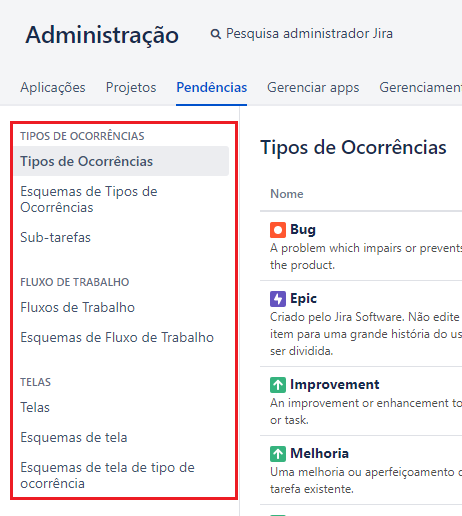

### README-Config-Jira.md
Guia de Configuração da ferramenta Jira para o projeto [Jira RPA aaS](../README.md)

---

Índice

* [Passo a Passo](#1-passo-a-passo)
  * [Criar Projeto](#11-criar-projeto)
  * [Configurar Tipos de Ocorrências](#12-configurar-tipos-de-ocorrências-para-as-pendências-do-projeto)
  * [Configurar Fluxo de Trabalho](#13-configurar-fluxo-de-trabalho-para-as-pendências-do-projeto)
  * [Configurar Campos Customizados](#14-configurar-campos-customizados-para-as-pendências-do-projeto)
  * [Configurar Telas](#15-configurar-telas-para-as-pendências-do-projeto)

---

# 1. Passo a Passo

## 1.1. Criar Projeto

* No menu `Pojeto >> Criar Projeto` escolha `Desenvolvimento de software básico` e clique no botão `Próximo`

* Na caixa de diálogo `Criar Projeto` confirme as opções existentes e clique no botão `Próximo`

* Na caixa de diálogo `Desenvolvimento de software Básico` preencha os campos/valores abaixo e clique no botão `Enviar`
  * Nome: `RPA`
  * Chave: `RAPA`

* No página `Ocorrências abertas` observar o projeto criado

---

## 1.2. Configurar Tipos de Ocorrências para as pendências do projeto

* No menu superior principal clique no link do item de menu `Administração >> Pendências`
* Na página de `Administração` na aba `Pendências` observar os itens do `sub-menu de Configurações de Pendências`

* Na página de `Configurações do Pendências` clicar no item do sub-menu `Tipos de Ocorrências`
* Na página de `Configurações do Pendências` no sub-menu `Tipos de Ocorrências` clicar no botão `Adicionar Tipos de Ocorrências`
* Na caixa de diálogo `Adicionar Tipo de Item` preencha os campos/valores abaixo e clique no botão `Adicionar`
  * Nome: `RPA`
  * Descrição: `RPA`
  * Tipo: `Tipo de Issue padrão`

* Na página de `Configurações do Pendências` no sub-menu `Esquemas de Tipos de Ocorrências` clicar no botão `Adicionar Tipos de Ocorrências` clicar no link `Editar` correspondente ao nome `RPA: Esquema de Tipo de Item para Desenvolvimento de Software`

* Na página de `Configurações do Pendências` no sub-menu `Esquemas de Tipos de Ocorrências` na aba `Modify Esquema de Tipo de Item` arrastar e soltar nas lista `Tipos de Itens para o actual regime` e  `Disponível Tipo de Itens` de forma que ao final sobre apenas o tipo de item `RPA` na lista `Tipos de Itens para o actual regime`. Em seguida clique no botão `Salvar`    

## 1.3. Configurar Fluxo de Trabalho para as pendências do projeto

* No menu superior principal clique no link do item de menu `Administração >> Pendências`
* Na página de `Administração` na aba `Pendências` observar os itens do `sub-menu de Configurações de Pendências`
* Na página de `Configurações do Pendências` clicar no item do sub-menu `Fluxos de Trabalho`
* Na página de `Administração` no sub-menu `Fluxos de Trabalhos` clicar no link `Editar` na linha relacionada ao projeto `Software Simplified Workflow for Project RPA`

* Na página de `Administração` no sub-menu `Fluxos de Trabalhos`
  * Clicar no botão `Diagrama` para ativar a edição do fluxo de trabalho de forma gráfica em um diagrama
  * Clicar no checkbox `Mostrar rótulos de transição` para mostrar rótulos na forma gráfica em um diagrama
  * Remover todos os estados existentes que foram herdados do tipo padrão do projeto: Ex: `TO DO`, `IN PROGRESS`, `IN REVIEW`, `DONE`
  * Criar a seguinte lista de estados com as seguintes propriedades de atributos:
    * `EM EDIÇÃO`: Categoria `Pendências` 
    * `SUBMETIDO`: Categoria `Em andamento`
    * `CONCLUÍDO`: Categoria `Concluído` 
    * `FALHA`: Categoria `Pendências`
    * `CANCELADO`: Categoria `Concluído` 
  * Criar as seguintes transiçõe de estados:
    * Do estado: `qualquer estado` - Para o estado: `CANCELADO` - Nome: `Cancelar` - Tela: `Nenhum`
    * Do estado: `EM EDIÇÃO` - Para o estado: `SUBMETIDO` - Nome: `Submeter` - Tela: `Nenhum`
    * Do estado: `SUBMETIDO` - Para o estado: `CONCUÍDO` - Nome: `Concluir` - Tela: `Nenhum`
    * Do estado: `FALHA`` - Para o estado: `EM EDIÇÃO` - Nome: `Editar` - Tela: `Nenhum`
  * Clicar no botão `Publicar` para salvar o seu rascunho como alteração definitiva
  * Na caixa de diálogo `Publicar Rascunho do Fluxo de Trabalho` escolher a opção `Salvar uma cópia backup - Não` e em seguida clicar no botão `Publicar`
  * Se você fez tudo certo Então o seu Workflow deve ficar assim:
  

## 1.4. Configurar Campos Customizados para as pendências do projeto

* No menu superior principal clique no link do item de menu `Administração >> Pendências`
* Na página de `Administração` na aba `Pendências` observar os itens do `sub-menu de Configurações de Pendências`
* Na página de `Configurações do Pendências` clicar no item do sub-menu `Campos Personalizados`
* Na página de `Administração` no sub-menu `Campos Personalizados` clicar no botão `Adicionar campo personalizado` para criar os seguintes campos:
  * `Qtde Submetido`: Tipo `Numérico`
  * `Data Submetido`: Tipo `Date Time Picker`
  * `Data Concluido`: Tipo `Date Time Picker`
  * `Data Falha`: Tipo `Date Time Picker`
  * `Data Cancelamento`: Tipo `Date Time Picker`
* Na página de `Administração` no sub-menu `Campos Personalizados` clicar no botão `ícone engrenagem` em seguida `Editar` para configurar cada um dos campos:
  * `Qtde Submetido`: Tipo `Numérico`
  * `Data Submetido`: Tipo `Date Time Picker`
  * `Data Concluido`: Tipo `Date Time Picker`
  * `Data Falha`: Tipo `Date Time Picker`
  * `Data Cancelamento`: Tipo `Date Time Picker`

* No menu superior principal clique no link do item de menu `Administração >> Projetos`
  * Na página de `Administração` na aba `Projetos` clicar no link com o nome do projeto `RPA`

* Na página de `Configurações Projeto` clicar no item do sub-menu `Reindexar Projeto`
  *  Em seguida, confirmar no botão `Iniciar a reindexação`
  *  Aguardar ate aparecer o botão `Finalizar`, quando aparecer clicar no botão `Finalizar`

## 1.5. Configurar Telas para as pendências do projeto

* No menu superior principal clique no link do item de menu `Administração >> Projetos`
  * Na página de `Administração` na aba `Projetos` clicar no link com o nome do projeto `RPA`

* Na página de `Configurações Projeto` clicar no item do sub-menu `Telas`
  * as configurações esperadas são: 

| Issue Type | Operação         | Tela                                                      |
| ---------- | ---------------- |---------------------------------------------------------- |
| RPA        | Criar Pendência  | RPA: Tela de Item Padrão para Desenvolvimento de Software |
| RPA        | Editar Pendência | RPA: Tela de Item Padrão para Desenvolvimento de Software |
| RPA        | Ver solicitação  | RPA: Tela de Item Padrão para Desenvolvimento de Software |

* No menu superior principal clique no link do item de menu `Administração >> Pendências`
* Na página de `Configurações do Pendências` clicar no item do sub-menu `Esquemas de tela`

* Na página de `Ver esquemas de Telas` de `Administração` na aba `Pendêncas` item`de sub-menu `Esquemas de tela`
  * Localizar a linha correspondente a tela `RPA: Tela de Item Padrão para Desenvolvimento de Software` e clicar no link `Configurar`
  * Em seguida, clicar no botão `Associar uma operação de ocorrência a uma tela` e adicionar as seguintes configurações
    * Na caixa de diálogo `Associar uma operação de ocorrência a uma tela` adicionar as seguintes configurações 

| Operação de Issue | Tela                                                      |
| ----------------- |---------------------------------------------------------- |
| Criar Pendência   | RPA: Tela de Item Padrão para Desenvolvimento de Software |
| Editar Pendência  | RPA: Tela de Item Padrão para Desenvolvimento de Software |
| Ver solicitação   | RPA: Tela de Item Padrão para Desenvolvimento de Software |

---

[README Home page](../README.md)

