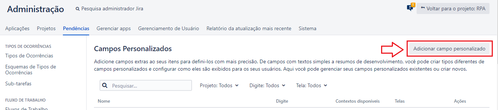
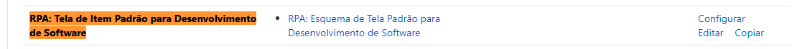
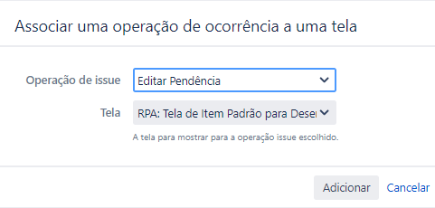

### README-Config-Jira.md
Guia de Configuração da ferramenta Jira para o projeto [Jira RPA aaS](../README.md)

---

Índice

* [Passo a Passo](#1-passo-a-passo)
  * [Criar Projeto](#11-criar-projeto)
  * [Configurar Tipos de Ocorrências](#12-configurar-tipos-de-ocorrências-para-as-pendências-do-projeto)
  * [Configurar Fluxo de Trabalho](#13-configurar-fluxo-de-trabalho-para-as-pendências-do-projeto)
  * [Configurar Campos Customizados](#14-configurar-campos-customizados-para-as-pendências-do-projeto)
  * [Configurar Telas](#15-configurar-telas-para-as-pendências-do-projeto)
  * [Configurar Grupos de Usuários, Usuários e Esquemas de Permissão](#16%20configurar%20grupos%20de%20usuários-%20Usuários%20e%20Esquemas%20de%20permissão)
  * [Configurar Condições das Transições](#17-configurar%20condições%20das%20transições%20do%20fluxo%20de%20trabalho%20vs%20grupo%20de%20usuários)

---

# 1. Passo a Passo

## 1.1. Criar Projeto

* No menu `Pojeto >> Criar Projeto` escolha `Desenvolvimento de software básico` e clique no botão `Próximo`

* Na caixa de diálogo `Criar Projeto` confirme as opções existentes e clique no botão `Próximo`

* Na caixa de diálogo `Desenvolvimento de software Básico` preencha os campos/valores abaixo e clique no botão `Enviar`
  * Nome: `RPA`
  * Chave: `RAPA`

* No página `Ocorrências abertas` observar o projeto criado

---

## 1.2. Configurar Tipos de Ocorrências para as pendências do projeto

* No menu superior principal clique no link do item de menu `Administração >> Pendências`
* Na página de `Administração` na aba `Pendências` observar os itens do `sub-menu de Configurações de Pendências`

* Na página de `Configurações do Pendências` clicar no item do sub-menu `Tipos de Ocorrências`
* Na página de `Configurações do Pendências` no sub-menu `Tipos de Ocorrências` clicar no botão `Adicionar Tipos de Ocorrências`
* Na caixa de diálogo `Adicionar Tipo de Item` preencha os campos/valores abaixo e clique no botão `Adicionar`
  * Nome: `RPA`
  * Descrição: `RPA`
  * Tipo: `Tipo de Issue padrão`

* Na página de `Configurações do Pendências` no sub-menu `Esquemas de Tipos de Ocorrências` clicar no botão `Adicionar Tipos de Ocorrências` clicar no link `Editar` correspondente ao nome `RPA: Esquema de Tipo de Item para Desenvolvimento de Software`

* Na página de `Configurações do Pendências` no sub-menu `Esquemas de Tipos de Ocorrências` na aba `Modify Esquema de Tipo de Item` arrastar e soltar nas lista `Tipos de Itens para o actual regime` e  `Disponível Tipo de Itens` de forma que ao final sobre apenas o tipo de item `RPA` na lista `Tipos de Itens para o actual regime`. Em seguida clique no botão `Salvar`    

---

## 1.3. Configurar Fluxo de Trabalho para as pendências do projeto

* No menu superior principal clique no link do item de menu `Administração >> Pendências`
* Na página de `Administração` na aba `Pendências` observar os itens do `sub-menu de Configurações de Pendências`
* Na página de `Configurações do Pendências` clicar no item do sub-menu `Fluxos de Trabalho`
* Na página de `Administração` no sub-menu `Fluxos de Trabalhos` clicar no link `Editar` na linha relacionada ao projeto `Software Simplified Workflow for Project RPA`

* Na página de `Administração` no sub-menu `Fluxos de Trabalhos`
  * Clicar no botão `Diagrama` para ativar a edição do fluxo de trabalho de forma gráfica em um diagrama
  * Clicar no checkbox `Mostrar rótulos de transição` para mostrar rótulos na forma gráfica em um diagrama
  * Remover todos os estados existentes que foram herdados do tipo padrão do projeto: Ex: `TO DO`, `IN PROGRESS`, `IN REVIEW`, `DONE`
  * Criar a seguinte lista de estados com as seguintes propriedades de atributos:
    * `EM EDIÇÃO`: Categoria `Pendências` 
    * `SUBMETIDO`: Categoria `Em andamento`
    * `CONCLUÍDO`: Categoria `Concluído` 
    * `FALHA`: Categoria `Pendências`
    * `CANCELADO`: Categoria `Concluído` 
  * Criar as seguintes transiçõe de estados:
    * Do estado: `qualquer estado` - Para o estado: `CANCELADO` - Nome: `Cancelar` - Tela: `Nenhum`
    * Do estado: `EM EDIÇÃO` - Para o estado: `SUBMETIDO` - Nome: `Submeter` - Tela: `Nenhum`
    * Do estado: `SUBMETIDO` - Para o estado: `CONCUÍDO` - Nome: `Concluir` - Tela: `Nenhum`
    * Do estado: `FALHA`` - Para o estado: `EM EDIÇÃO` - Nome: `Editar` - Tela: `Nenhum`
  * Clicar no botão `Publicar` para salvar o seu rascunho como alteração definitiva
  * Na caixa de diálogo `Publicar Rascunho do Fluxo de Trabalho` escolher a opção `Salvar uma cópia backup - Não` e em seguida clicar no botão `Publicar`
  * Se você fez tudo certo Então o seu Workflow deve ficar assim:
  

---

## 1.4. Configurar Campos Customizados para as pendências do projeto

* No menu superior principal clique no link do item de menu `Administração >> Pendências`
* Na página de `Administração` na aba `Pendências` observar os itens do `sub-menu de Configurações de Pendências`
* Na página de `Configurações do Pendências` clicar no item do sub-menu `Campos Personalizados`
* Na página de `Administração` no sub-menu `Campos Personalizados` clicar no botão `Adicionar campo personalizado` para criar os seguintes campos:
  * `Qtde Submetido`: Tipo `Numérico`
  * `Data Submetido`: Tipo `Date Time Picker`
  * `Data Concluido`: Tipo `Date Time Picker`
  * `Data Falha`: Tipo `Date Time Picker`
  * `Data Cancelamento`: Tipo `Date Time Picker`
* Na página de `Administração` no sub-menu `Campos Personalizados` clicar no botão `ícone engrenagem` em seguida `Editar` para configurar cada um dos campos:
  * `Qtde Submetido`: Tipo `Numérico`
  * `Data Submetido`: Tipo `Date Time Picker`
  * `Data Concluido`: Tipo `Date Time Picker`
  * `Data Falha`: Tipo `Date Time Picker`
  * `Data Cancelamento`: Tipo `Date Time Picker`

* No menu superior principal clique no link do item de menu `Administração >> Pendências`
* Na página de `Administração` na aba `Pendências` observar os itens do `sub-menu de Configurações de Pendências`
* Na página de `Configurações do Pendências` clicar no item do sub-menu `Configurações de Campos`
* Na página de `Ver Configurações de Campo` em `Administração` no sub-menu `Campos Personalizados` clicar no botão `Adicionar configurações de campo`:
  * Na caixa de diálogo `Adicione uma configuração de campo` preencha os campos/valores abaixo e clique no botão `Adicionar`
    * Nome: `RPA: Configurações de Campo`
    * Clique no botão `Adicionar`

* Em seguida configure os campos da configuração de campos `RPA: Configurações de Campo` que acabou de ser criada:
  * No menu superior principal clique no link do item de menu `Administração >> Pendências`
  * Na página de `Administração` na aba `Pendências` observar os itens do `sub-menu de Configurações de Pendências`
  * Na página de `Configurações do Pendências` clicar no item do sub-menu `Configurações de Campos`
    * Clique no botão `Configurar`
    * Na págna `Ver configuração do campo` de `RPA: Configurações de Campo` para *cada uma* das linhas de configuração de um campo configurar conforme tabela abaixo
    * Os campos que não estiverem presentes na tabela de configuração abaixo devem ser escondidos clicando no link `Esconder`.
    * Os campos sistêmicos ou automaticamente renderizados que não devem ser alterados estarão em _itálico_ na tabela de configuração

| Nome do campo              | Telas                                                           |
| -------------------------- | --------------------------------------------------------------- |
| `Acompanhamento de Horas`, `Anexos`, `Data Cancelamento`, `Data Concluido`, `Data Falha`, `Data Submetido`, `Pendências Linkadas`, `Prioridade`, `Qtde Submetido`, `Responsável`, `Resumo`, `Rótulos`, `Solicitante`, `Tipo de Item` | 
* `RPA: Tela de Item Padrão para Desenvolvimento de Software` 
* `RPA: Tela de Item Padrão para Desenvolvimento de Software (Ver)` |
| `Comentário`                 | _Renderers_                                                     |
| `Descrição`                  | _Renderers_                                                     |
| `Resolução`                  | _Resolve Issue Screen_                                          |

* Em seguida configure os `Esquemas de configurações de campos`:
  * No menu superior principal clique no link do item de menu `Administração >> Pendências`
  * Na página de `Administração` na aba `Pendências` observar os itens do `sub-menu de Configurações de Pendências`
  * Na página de `Configurações do Pendências` clicar no item do sub-menu `Esquemas de Configurações de Campos` e clicar no botão `Adicionar Esquema de configuração de campo`
    * Na caixa de diálogo `Adicionar esquemas de configuração de campo` preencha os campos/valores abaixo e clique no botão `Adicionar`
    * Nome: `RPA: Esquema de configuração de campo`
      * Clique no botão `Adicionar`

* Em seguida configure o esquema de configuração de campos `RPA: Esquema de configuração de campo` que acabou de ser criada:
  * No menu superior principal clique no link do item de menu `Administração >> Pendências`
  * Na página de `Administração` na aba `Pendências` observar os itens do `sub-menu de Configurações de Pendências`
  * Na página de `Configurações do Pendências` clicar no item do sub-menu `Esquemas de Configurações de Campos`
    * Clique no botão `Configurar`
    * Na págna `Configurar o esquema de configuração de campo` de `RPA: Esquema de configuração de campo` o resultado esperado deve ser o abaixo

| Nome                                  | Telas                        |
| ------------------------------------- | ---------------------------- |
| RPA: Esquema de configuração de campo |  RPA: Configurações de Campo |

* No menu superior principal clique no link do item de menu `Administração >> Projetos`
  * Na página de `Administração` na aba `Projetos` clicar no link com o nome do projeto `RPA`

* Na página de `Configurações do Projeto` clicar no item do sub-menu `Reindexar Projeto`
  *  Em seguida, confirmar no botão `Iniciar a reindexação`
  *  Aguardar ate aparecer o botão `Finalizar`, quando aparecer clicar no botão `Finalizar`

---

## 1.5. Configurar Telas para as pendências do projeto

* No menu superior principal clique no link do item de menu `Administração >> Projetos`
  * Na página de `Administração` na aba `Projetos` clicar no link com o nome do projeto `RPA`

* Na página de `Configurações do Projeto` clicar no item do sub-menu `Telas`
  * as configurações esperadas são: 

| Issue Type | Operação         | Tela                                                      |
| ---------- | ---------------- |---------------------------------------------------------- |
| RPA        | Criar Pendência  | RPA: Tela de Item Padrão para Desenvolvimento de Software |
| RPA        | Editar Pendência | RPA: Tela de Item Padrão para Desenvolvimento de Software |
| RPA        | Ver solicitação  | RPA: Tela de Item Padrão para Desenvolvimento de Software |

* No menu superior principal clique no link do item de menu `Administração >> Pendências`

* Na página de `Configurações do Pendências` clicar no item do sub-menu `Telas`
  * Localizar a linha correspondente a tela `RPA: Tela de Item Padrão para Desenvolvimento de Software` e clicar no link `Copiar`
  * Em seguida, na página de diálogo `Copiar Tela` configurar os campos:
    * Nome: `RPA: Esquema de Tela Padrão para Desenvolvimento de Software (Ver)`
    * Clique no botão `Copiar`

* Na página de `Configurações do Pendências` clicar no item do sub-menu `Telas`
  * Localizar a linha correspondente a tela `RPA: Tela de Item Padrão para Desenvolvimento de Software (Ver)` e clicar no link `Configurar`
  * Em seguida, no formulário `Configurar Tela` configurar os campos:
    * Adicionar as seguintes configurações:

| Campo Tabulação   |
| ----------------- |
| Data Submetido    |
| Qtde Submetido    |
| Data Concluido    |
| Data Falha        |
| Data Cancelamento |

* Na página de `Configurações do Pendências` clicar no item do sub-menu `Telas`
  * Localizar a linha correspondente a tela `RPA: Tela de Item Padrão para Desenvolvimento de Software` e clicar no link `Configurar`
  * Em seguida, no formulário `Configurar Tela` configurar os campos:
    * Adicionar as seguintes configurações:

| Campo Tabulação   |
| ----------------- |
| Data Submetido    |
| Qtde Submetido    |
| Data Concluido    |
| Data Falha        |
| Data Cancelamento |

* Na página de `Configurações do Pendências` clicar no item do sub-menu `Esquemas de tela`
* Na página de `Ver esquemas de Telas` de `Administração` na aba `Pendêncas` item`de sub-menu `Esquemas de tela`
  * Localizar a linha correspondente a tela `RPA: Esquema de Tela Padrão para Desenvolvimento de Software` e clicar no link `Configurar`
  * Em seguida, clicar no botão `Associar uma operação de ocorrência a uma tela` e adicionar as seguintes configurações
    * Na caixa de diálogo `Associar uma operação de ocorrência a uma tela` adicionar as seguintes configurações 

| Operação de Issue | Tela                                                            |
| ----------------- |---------------------------------------------------------------- |
| Criar Pendência   | RPA: Tela de Item Padrão para Desenvolvimento de Software       |
| Editar Pendência  | RPA: Tela de Item Padrão para Desenvolvimento de Software       |
| Ver solicitação   | RPA: Tela de Item Padrão para Desenvolvimento de Software (Ver) |

---

## 1.6. Configurar Grupos de Usuários, Usuários e Esquemas de Permissão

* No menu superior principal clique no link do item de menu `Administração >> Gerenciamento de Usuários`
  * Na página de `Administração` na aba `Gerenciamento de Usuário` clique no item de sub-menu `Grupos`

* Na página de `Administração` na aba `Gerenciamento de Grupos` na aba `Grupos` clicar em `Adicionar Grupo`
    * Adicionar as seguintes configurações:

| Nome do Grupo        | Membros do Grupo |
| -------------------- | ---------------- |
| `rpa-administrators` | `user`, `admin`  |
| `rpa-users`          | `user`           |

---

## 1.7. Configurar Condições das Transições do Fluxo de Trabalho vs Grupo de Usuários

* No menu superior principal clique no link do item de menu `Administração >> Projetos`
  * Na página de `Administração` na aba `Projetos` clicar no link com o nome do projeto `RPA`

* Na página de `Configurações do Projeto` clicar no item do sub-menu `Fluxos de Trabalho`

  
* Na página `Fluxos de Trabalho` de `Configurações do Projeto` localizar a linha da configuração `Software Simplified Workflow for Project RPA` e clicar no ícone de lápis nas `Ações`

* Na página edição do `Fluxos de Trabalho` `Software Simplified Workflow for Project RPA` de `Configurações do Projeto` clicar no botão `Diagrama` para mostrar o modo de visualização do diagrama o que facilita as alterações
  * Se você fez tudo certo Então o seu Workflow deve ficar assim:
  

* Agora você vai realizar as configurações `Grupo` para cada uma das `Transições` conforme a tabela de configuração informada abaixo. Para tal siga os passos:
  * Na página de edição do Diagrama, você ira clicar em **cada uma das linhas** que representam as transições e em seguida no link `Condições`
  * Na página de edição das condições das `Transações` de **cada uma das transações** 
    * Adicionar a condição `O usuário está no grupo`
      * Grupo: `rpa-users` ou `rpa-administrators` conforme a tabela de configurações abaixo
    * Clicar no botão de  `Publicar` o fluxo de trabalho
      * Escolher a opção `Não` para a pergunta `Salvar Cópia do Backup` e confirmar no botão `Publicar`

| Transição   | Status de   | Status para | Grupo(s)             |
| ----------- | ----------- | ----------- | -------------------- |
| `Submeter`  | `EM EDIÇÃO` | `SUBMETIDO` | `rpa-users`          |
| `Concluir`  | `SUBMETIDO` | `CONCLUÍDO` | `rpa-administrators` |
| `Falhar`    | `SUBMETIDO` | `FALHA`     | `rpa-administrators` |
| `Editar`    | `FALHA`     | `EM EDIÇÃO` | `rpa-users`          |
| `Cancelar`  | _todos_     | `CANCELADO` | `rpa-users`          |

---

[README Home page](../README.md)

