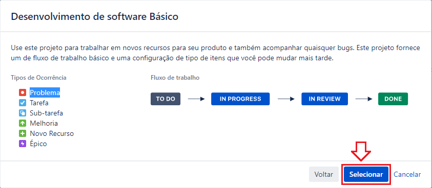
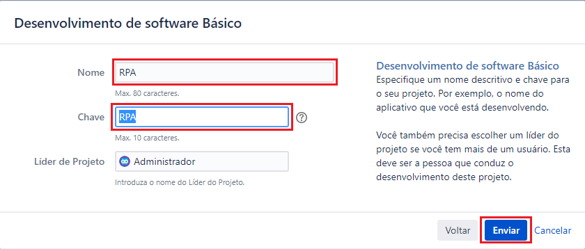

### README-Config-Jira.md
Guia de Configuração da ferramenta Jira para o projeto [Jira RPA aaS](../README.md)

Índice

* [Passo a Passo](#1-passo-a-passo)
  * [Passo a Passo](#1-passo-a-passo)
    * [Criar Projeto](#11-criar-projeto)
  * 
# 1. Passo a Passo

## 1.1. Criar Projeto

* No menu `Pojeto >> Criar Projeto` escolha `Desenvolvimento de software básico` e clique no botão `Próximo`

* Na caixa de diálogo `Criar Projeto` confirme as opções existentes e clique no botão `Próximo`

* Na caixa de diálogo `Desenvolvimento de software Básico` preencha os campos/valores abaixo e clique no botão `Enviar`
  * Nome: `RPA`
  * Chave: `RAPA`

* No página `Ocorrências abertas` observar o projeto criado

## 1.2. Configurar Tipos de Ocorrências para o projeto

* No menu `Pojeto >> Ver todos os projetos` clique no link do nome do projeto `RPA`

* No `menu lateral esquerdo` da página `Ocorrências abertas` clicar no link `Configurações do Projeto`

---

[README Home page](../README.md)

